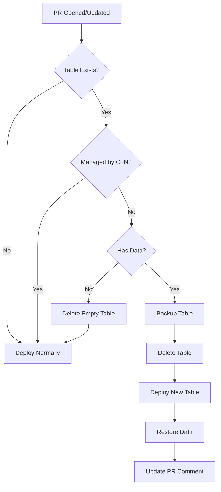

# Pipeline Table Handling Guide

## Overview

The GitHub Actions pipelines now automatically handle orphaned DynamoDB tables with data, ensuring deployments don't fail when tables exist but aren't managed by CloudFormation.

### Detection Method

The pipelines use **CloudFormation API-based detection** instead of relying on resource tags:

- ✅ Queries `describe-stack-resources` to check if table is managed
- ✅ Matches by `ResourceType` and `PhysicalResourceId`
- ✅ Handles hash suffixes in logical IDs (e.g., `MainTable74195DAB`)
- ✅ Avoids false positives from missing CloudFormation tags

This approach is more reliable than tag-based detection, which can produce false positives when tables are missing the `aws:cloudformation:stack-name` tag despite being CloudFormation-managed.

**Note:** This detection method was updated on 2025-12-25 to fix false positive issues. See `CLOUDFORMATION_DETECTION_FIX.md` for details.

---

## How It Works

### PR Preview Pipeline (`pr-preview.yml`)

When a PR is opened or updated, the pipeline:

1. **Checks for Orphaned Tables**
   ```yaml
   - Detects if table exists
   - Checks if managed by CloudFormation
   - Counts items in table
   ```

2. **Automatic Backup** (if table has data)
   ```yaml
   - Creates AWS on-demand backup
   - Exports data to JSON
   - Uploads backup as workflow artifact (7 day retention)
   ```

3. **Recreates Table**
   ```yaml
   - Deletes orphaned table
   - Waits for deletion
   - Deploys fresh CloudFormation-managed table
   ```

4. **Restores Data**
   ```yaml
   - Finds most recent backup
   - Restores all items to new table
   - Reports restoration status in PR comment
   ```

### Main Deploy Pipeline (`deploy.yml`)

The main deployment pipeline is more conservative:

**For Production:**
- ❌ **Fails deployment** if orphaned table detected
- 📢 Provides manual import instructions
- 🛡️ Requires explicit human intervention

**For Dev/Test:**
- ✅ Automatic backup and recreation (same as PR preview)
- 🔄 Seamless deployment continues

---

## Workflow Steps

### PR Preview Deployment



**PR Comment Example:**

```markdown
## 🚀 Preview Environment Deployed

Your preview environment is ready!

**Environment:** `pr-5`
**Web App:** https://d123abc.cloudfront.net
**GraphQL API:** https://xyz.appsync-api.us-east-1.amazonaws.com/graphql

### 📦 Data Restoration

✅ Successfully restored **1 items** from backup

> An orphaned table was detected with existing data. The data was backed up,
> the table recreated, and data restored automatically.

This environment will be automatically destroyed when the PR is merged or closed.
```

### Main Deployment (Dev/Test)

```bash
# Same as PR preview
1. Detect orphaned table
2. Backup data
3. Recreate table
4. Deploy
```

### Main Deployment (Production)

**Default Behavior (Safe):**
```bash
# Conservative approach
1. Detect orphaned table
2. FAIL deployment
3. Show manual import instructions
4. Require human intervention
```

**With Force Cleanup Option:**
```bash
# Same as dev/test when enabled
1. Detect orphaned table
2. Backup data
3. Delete and recreate
4. Restore data
5. Deploy
```

**Failure Message (when force_cleanup not enabled):**
```
::error::Orphaned production table detected! Manual intervention required.
::error::Options:
::error::  1. Re-run workflow with 'force_cleanup' enabled to auto-backup and recreate
::error::  2. Run locally: ./scripts/backup-table.sh prod && delete table && redeploy
```

---

## Features

### 1. Automatic Backup

Every orphaned table with data is backed up **twice**:

**AWS On-Demand Backup:**
- Stored in DynamoDB backups
- 35-day retention
- Can restore to new table
- Regional

**JSON Export:**
- Stored as workflow artifact
- 7-day retention (configurable)
- Portable across regions
- Can inspect/modify

### 2. Artifact Storage

Backups are uploaded as GitHub Actions artifacts:

```yaml
- name: Upload backup artifacts
  uses: actions/upload-artifact@v4
  with:
    name: table-backup-pr-5
    path: backups/
    retention-days: 7
```

**To download:**
1. Go to workflow run
2. Click "Artifacts"
3. Download `table-backup-pr-5`

### 3. Data Restoration

Automatic restoration with progress tracking:

```bash
🔄 Restoring table data from backup...
  Processing batch 1/1...
✓ Restore completed successfully!
  Items in backup: 1
  Items restored: 1
  Final item count: 1
```

### 4. PR Comments

The PR comment automatically updates with restoration status:

- ✅ **Success** - Shows item count restored
- ⚠️ **Failed** - Links to workflow logs and artifacts
- ⚠️ **No Backup** - Warns about potential data loss

---

## Configuration

### Using Force Cleanup for Production

**When to Use:**
- After destroying production and redeploying
- When you're confident the data can be restored
- When you want automatic handling instead of manual intervention

**How to Enable:**

1. Go to **Actions** tab in GitHub
2. Click on **Deploy to AWS** workflow
3. Click **Run workflow**
4. Select:
   - **Environment:** `prod`
   - **Force cleanup:** ✅ (check the box)
5. Click **Run workflow**

**What Happens:**
1. ✅ Detects orphaned table with data
2. ✅ Creates AWS backup (35-day retention)
3. ✅ Exports JSON backup (uploaded as artifact)
4. ✅ Deletes orphaned table
5. ✅ Deploys fresh CloudFormation-managed table
6. ✅ Restores all data from backup
7. ✅ Shows restoration status in deployment summary

**Safety Notes:**
- ⚠️ Always verify backups exist before enabling
- ⚠️ Data is backed up twice (AWS + JSON) for safety
- ⚠️ Backup artifacts retained for 30 days
- ⚠️ Use with caution - this bypasses production safety checks

**Default Behavior (Recommended):**
- Force cleanup is **disabled** by default for production
- Deployment will fail with clear instructions
- Requires manual intervention to proceed
- Maximum safety for production data

### Adjusting Backup Retention

**Workflow Artifacts:**
```yaml
# In .github/workflows/pr-preview.yml
retention-days: 7  # Change to 1-90 days
```

**AWS Backups:**
```bash
# Automatically expire after 35 days
# To change, modify backup-table.sh
```

### Production Behavior

**To allow automatic handling in production:**

```yaml
# In .github/workflows/deploy.yml, remove this check:
if [ "$STAGE" = "prod" ]; then
  echo "::error::Orphaned production table detected!"
  exit 1
fi
```

**⚠️ Warning:** Not recommended! Production data should be handled manually.

### Disabling Auto-Restore

**To backup only (no restore):**

```yaml
# Comment out this step in pr-preview.yml:
# - name: Restore table data (if backup exists)
```

---

## Troubleshooting

### Issue: Restoration Failed

**Symptoms:**
```
⚠️ Table backup was created, but restoration failed
```

**Solutions:**

1. **Download backup artifact**
   - Go to workflow run
   - Download `table-backup-pr-X`
   - Manually restore locally

2. **Check logs**
   ```bash
   # In workflow logs, look for:
   - Batch write errors
   - Throttling issues
   - Permission errors
   ```

3. **Manual restore**
   ```bash
   # Download backup from artifacts
   ./scripts/restore-table.sh pr-5 backups/pr-5-main-table-*.json
   ```

### Issue: Production Deployment Blocked

**Symptoms:**
```
::error::Orphaned production table detected! Manual intervention required.
```

**Solution:**

```bash
# Option 1: Import table (recommended)
./scripts/import-existing-table.sh prod

# Option 2: Manual backup and recreate
./scripts/backup-table.sh prod
# Then delete via AWS Console or CLI
# Then redeploy
```

### Issue: Backup Artifact Not Found

**Symptoms:**
```
⚠️ No backup file found, skipping restore
```

**Causes:**
- Backup step failed
- Not enough time between backup and restore
- Backup directory not created

**Solution:**

Check if backup was actually created:
```bash
# In workflow logs, look for:
📦 Backing up existing table before deployment...
✓ AWS backup created
✓ Data exported
```

### Issue: Table Still Orphaned After Deployment

**Symptoms:**
Deployment succeeds but table still not managed by CloudFormation

**Solution:**

```bash
# Verify table is managed
aws cloudformation describe-stack-resources \
  --stack-name pr-5-aws-boilerplate-database \
  --logical-resource-id MainTable

# If not, run import
./scripts/import-existing-table.sh pr-5
```

---

## Manual Overrides

### Skip Automatic Handling

**To deploy without automatic table handling:**

```bash
# Manually in GitHub Actions:
# 1. Go to Actions tab
# 2. Run workflow manually
# 3. Comment out table handling steps before run

# OR locally:
./scripts/deploy-with-cleanup.sh pr-5 --webapp --skip-cleanup
```

### Force Table Deletion

**In development only:**

```bash
# Before deploying, manually delete table
aws dynamodb delete-table --table-name pr-5-main-table

# Then deploy normally
```

---

## Monitoring

### View Backup Status

**In GitHub Actions UI:**
1. Go to workflow run
2. Expand "Check for existing table with data"
3. Look for:
   ```
   ⚠️ Orphaned table with X items detected
   ```

**In AWS:**
```bash
# List DynamoDB backups
aws dynamodb list-backups --table-name pr-5-main-table

# Check table status
aws dynamodb describe-table --table-name pr-5-main-table
```

### Download Backups

**From GitHub:**
1. Navigate to workflow run
2. Scroll to "Artifacts"
3. Click `table-backup-pr-X.zip`

**From AWS:**
```bash
# Restore from AWS backup
aws dynamodb restore-table-from-backup \
  --target-table-name pr-5-main-table-restored \
  --backup-arn <arn-from-list-backups>
```

---

## Best Practices

### ✅ DO

1. **Monitor PR comments** for restoration status
2. **Download backup artifacts** before they expire (7 days)
3. **Verify data** after automatic restoration
4. **Use manual import** for production tables
5. **Keep backups** for important PR environments

### ❌ DON'T

1. **Don't disable safety checks** in production
2. **Don't delete backups** until verified
3. **Don't skip backup step** in workflows
4. **Don't ignore restoration failures**
5. **Don't rely only on automatic backups** for critical data

---

## Safety Guarantees

### Data Protection

1. **Always Backup Before Delete**
   - Automatic backup before any deletion
   - Dual backup (AWS + JSON)
   - Artifacts uploaded to GitHub

2. **Production is Protected**
   - Automatic handling disabled
   - Manual intervention required
   - Explicit confirmation needed

3. **Restoration Verification**
   - Item count validation
   - Error reporting
   - PR comment feedback

### Failure Modes

**If backup fails:**
- Table is NOT deleted
- Deployment continues with warning
- Manual intervention required

**If restore fails:**
- Backup is still available in artifacts
- Error shown in PR comment
- Can manually restore later

**If deployment fails:**
- Table remains (if backup succeeded)
- Backup artifacts persist
- Can retry deployment

---

## Summary

The pipelines now handle orphaned tables automatically:

**PR Previews:**
- ✅ Automatic backup
- ✅ Automatic recreation
- ✅ Automatic restore
- ✅ Status in PR comments
- ✅ Backup artifacts

**Dev/Test:**
- ✅ Same as PR previews
- ✅ Seamless deployments

**Production:**
- ❌ Automatic handling disabled
- 📢 Manual import required
- 🛡️ Maximum safety

All backups are stored both in AWS and as GitHub artifacts for maximum safety!
